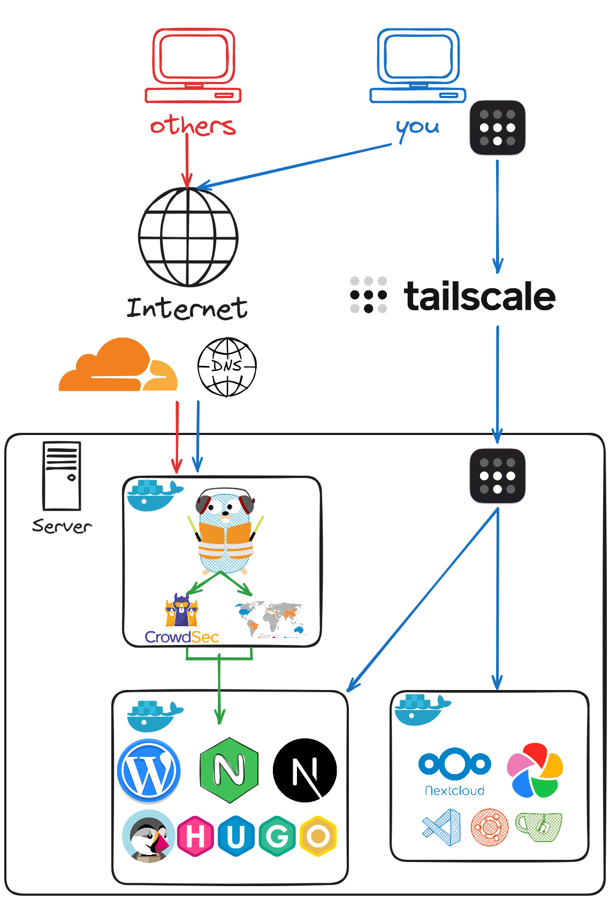

+++
author = "brockar"
title = "Secure server setup: VPN and Reverse Proxy Config"
date = '2025-07-05'
description = "Secure server setup guide: Use Tailscale VPN for private access and Traefik reverse proxy for public services with automatic SSL and security features."
categories = [
    "Linux"
]
tags = [
    "linux",
    "server",
    "debian",
    "configuration"
]

image = "banner.webp"

[[links]]
title = "Configure Your Server"
website = "https://blog.mguz.dev/p/my-linux-server-config/#server-essentials"
image = "https://blog.mguz.dev/img/avatar_hu_129dd3cd717ddc67.png"

[[links]]
title = "traefik configuration"
website = "https://github.com/brockar/traefik"
image = "https://external-content.duckduckgo.com/iu/?u=https%3A%2F%2Ftse1.mm.bing.net%2Fth%2Fid%2FOIP.ex75g4-5QfD5ES2M34-MnwHaHa%3Fpid%3DApi&f=1&ipt=d982c23d8c92ec18eb8425ed2d98805ddad01d52a107810aa9bbfc4c00f041c1"

[[links]]
title = "traefik"
website = "https://traefik.io/traefik"
image = "https://encrypted-tbn0.gstatic.com/images?q=tbn:ANd9GcR5TgvfyQXTfJo_XdQc6eP0GLWYev0JaMrhAQ&s"

[[links]]
title = "Traefik Plugins"
website = "https://doc.traefik.io/traefik/plugins/"
image = "https://encrypted-tbn0.gstatic.com/images?q=tbn:ANd9GcR5TgvfyQXTfJo_XdQc6eP0GLWYev0JaMrhAQ&s" 

+++


## TL;DR

This post covers how to securely expose your server to the internet while keeping sensitive services private.  
You'll learn how to make only the services you want public (like a website), while keeping others—such as Calibre, FileBrowser, or SSH—accessible only through a secure VPN.  
For private access, we'll use [Tailscale](https://tailscale.com/) because it's easy to set up and use.  
For the public services, we'll use [Traefik](https://traefik.io/traefik/) as a reverse proxy, with SSL certificates automatically and provide additional security features like geographic blocking and CrowdSec integration.

By the end, you'll know how to keep your server safe from unwanted exposure while still being able to access everything you need from anywhere.

<p align="center">
  
</p>

---

## Tailscale

Tailscale is a secure VPN service that allows you to connect your devices over the internet as if they were on the same local network, without needing to expose them publicly.

> *Important*  
> **Tailscale is free if you use it for personal use**, but if you want to use it for business you need to pay for it.  
> On the free tier you can have **up to 3 users and 100 devices**, which is enough for most personal use cases.  
> You will use one same account for all your devices, so you can access to your server from your phone, laptop, desktop, etc.  
> Also you can invite up to 2 other users to your network, so you can share your server with your friends or family.  

### Create your account

1. Go to the [Tailscale website](https://tailscale.com/).
2. Click on "Get started - It's Free!" and follow the prompts to create an account.

### Install Tailscale

[Install Tailscale on your server](https://tailscale.com/download) by following the instructions for your operating system.
For example, on Debian you can run:

```bash
curl -fsSL https://tailscale.com/install.sh | sh
```

### Start Tailscale

After installing Tailscale, you can start it with the following command:

```bash
sudo tailscale up
```

This will prompt you to authenticate your device with your Tailscale account. Follow the instructions in the terminal to complete the authentication process.

### Access Your Server

Once Tailscale is running on your server, you need to install the Tailscale app on your other devices (laptop, phone, etc.) and log in with the same account you used on your server.  
After logging in, you will see your server listed in the Tailscale app with its Tailscale IP address (usually in the format `100.x.x.x`).  
You can use this IP address to connect to your server securely without exposing it to the public internet.

You can find this IP address by running:

```bash
tailscale status
```

This will show you a list of devices connected to your Tailscale network, along with their Tailscale IP addresses.
You can also access your server using the system hostname, for example:

```bash
ssh user@debian # or whatever your hostname is on your server
```

Now you can disable the public SSH port on your server to prevent unauthorized access.

---

## Traefik

Traefik is a modern reverse proxy and load balancer that makes deploying microservices easy. It automatically discovers services and configures itself dynamically, making it a great choice for managing your server's web traffic.

In this setup, we'll configure Traefik with several security features:

- **Automatic SSL certificates** via Let's Encrypt and Cloudflare DNS
- **Geographic blocking** to restrict access by country
- **CrowdSec integration** for protection against malicious traffic
- **Automatic service discovery** through Docker labels

### Prerequisites

Before setting up Traefik, ensure you have:

- A domain name managed by Cloudflare
- Docker and Docker Compose installed on your server
- Your domain's A record pointing to your server's public IP address

> **Why Cloudflare?**  
> We use Cloudflare because Traefik can automatically manage DNS challenges for SSL certificate generation, and it provides excellent DDoS protection and CDN services.

### Installing Traefik

I use Docker to run Traefik. You can find my complete configuration in my [GitHub repository](https://github.com/brockar/traefik).

Clone the repository and navigate to the directory:

```bash
git clone git@github.com:brockar/traefik.git
cd traefik
```

Copy the example environment file and edit it with your values:

```bash
cp .env.example .env
nano .env  # or use your preferred editor
```

#### Getting your Cloudflare API Token

To allow Traefik to manage your DNS records for SSL certificates, you need a Cloudflare API token:

1. Go to your [Cloudflare dashboard](https://dash.cloudflare.com/)
2. Click the **user icon** on the top right, then select **My Profile**
3. Navigate to the **API Tokens** section
4. Click **Create Token**
5. Use the **Edit zone DNS** template
6. Set the permissions to **Zone:DNS:Edit**
7. Select the zone you want to manage (or all zones for convenience)
8. Click **Continue to summary** and then **Create Token**
9. Copy the token and paste it into the `CLOUDFLARE_API_TOKEN` field in your `.env` file

#### Configure Traefik Files

You need to manually edit several configuration files to customize Traefik for your setup.

##### Update Certificate Resolver

Edit `config/traefik.yml` to set your email address:

```yaml
certificatesResolvers:
  cloudflare:
    acme:
      email: your-email@domain.com # Replace with your Cloudflare account email
```

##### Configure Security Middlewares

Edit `config/dynamic.yml` to set up geoblock and CrowdSec:

```yaml
# Geographic blocking configuration
ar-only:
  plugin:
    geoblock:
      allowedIPAddresses:
        - "YOUR.VPS.IP"  # Add your VPS IP if outside your country
      countries:  
        - AR  # Replace with your country code (https://en.wikipedia.org/wiki/ISO_3166-1_alpha-2)
        # - US  # Add more countries if needed
        
# CrowdSec configuration  
crowdsec:
  plugin:
    bouncer:
      crowdsecLapiKey: ##REPLACE_API_KEY##  # Replace CrowdSec API key (docker exec crowdsec cscli bouncers add 
      forwardedHeadersTrustedIPs:
        - "YOUR.VPS.IP"  # Replace with your server's public IP
```

> **Finding your country code**: Visit [ISO 3166-1 alpha-2 codes](https://en.wikipedia.org/wiki/ISO_3166-1_alpha-2) to find your country's two-letter code.

### Setup Docker Networks and CrowdSec API Key

Before starting Traefik, we need to create the necessary Docker networks and set up CrowdSec:

```bash
# Create Docker networks
docker network create proxy
docker network create crowd1

# Set proper permissions for certificate storage
chmod 600 ./certs

# Start and down Traefik to create necessary volumes
docker compose up -d && docker compose down

# Start CrowdSec 
cd crowdsec
docker compose up -d

# Generate CrowdSec API key for Traefik
docker exec crowdsec cscli bouncers add crowdsecBouncer
```

Copy the generated API key and replace `##REPLACE_API_KEY##` in your `config/dynamic.yml` file.

Also, get your server's public IP address:

```bash
curl ifconfig.co
```

Use this IP to replace `YOUR.VPS.IP` in your configuration files.

### Start Traefik

Now you can start Traefik:

```bash
cd ../traefik
docker compose up -d
```

Check if Traefik is running correctly:

```bash
docker logs traefik
```

### Configure Your Services

There are two ways to configure services with Traefik:

#### Docker Labels (Recommended)

Add labels directly to your service's `compose.yml` file.  
This method keeps configuration close to the service and automatically updates when you *restart the container*.

#### Static Configuration Files

Create separate configuration files in the `config/` directory. This method allows you to update routing without restarting containers.

### Example Service Configuration

Here's a complete example of exposing a service using Docker labels:

```yaml
services:
  whoami:
    image: traefik/whoami
    container_name: whoami
    restart: unless-stopped
    networks:
      - proxy
    labels:
      # Basic routing
      - "traefik.enable=true"
      - "traefik.docker.network=proxy"
      
      # Basic routing configuration
      - "traefik.http.routers.whoami.entrypoints=websecure"
      - "traefik.http.routers.whoami.rule=Host(`whoami.yourdomain.com`)"
      
      # SSL configuration
      - "traefik.http.routers.whoami.tls=true"
      - "traefik.http.routers.whoami.tls.certresolver=cloudflare"
      
      # Security middlewares
      - "traefik.http.routers.whoami.middlewares=secureHeaders@file,crowdsec@file"
      
      # Optional: Geographic restriction (uncomment if needed)
      # - "traefik.http.routers.whoami.middlewares=secureHeaders@file,crowdsec@file,ar-only@file"

networks:
  proxy:
    external: true
```

## Alternatives

You can use any VPN solution for private access to your server, not just Tailscale. For example, [WireGuard](https://www.wireguard.com/) is a popular alternative that you can self-host and configure to fit your needs. However, with WireGuard and similar self-hosted VPNs, you'll need to manually open ports on your firewall and router, and ongoing management can be more complex compared to Tailscale's streamlined setup.

On the Traefik side, you don't have to use Cloudflare. You can use any other DNS provider that supports ACME challenges, like [DuckDNS](https://www.duckdns.org/) or [Google Domains](https://domains.google/).

GeoBlock isn't mandatory, you can remove it if you don't need it or use it only on specific services.

You can also use other reverse proxies like [Nginx Proxy](https://docs.nginx.com/nginx/admin-guide/web-server/reverse-proxy/) or [Caddy](https://caddyserver.com/), but I prefer Traefik because it has many features out of the box and is easy to configure with Docker.

